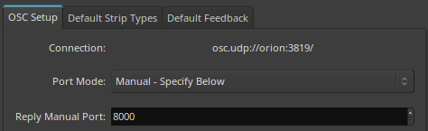
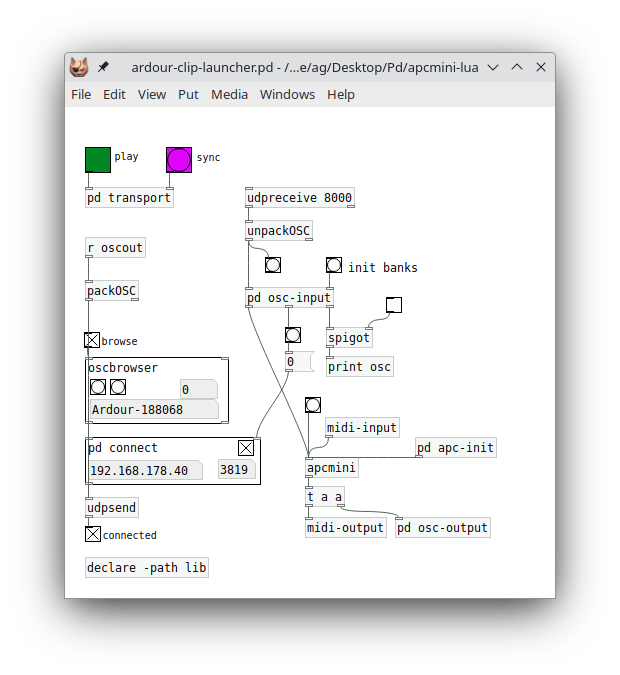

# ardour-clip-launcher

This Pd patch implements a MIDI to OSC bridge for Ardour's clip launcher in the Cue window. As this is still a fairly recent development which arrived in Ardour 7.x, support for corresponding control surfaces which work with this feature is still pretty thin (just the Ableton Push at the time of this writing, although support for the Novation launchpads seems to be planned). The AKAI APC mini is an excellent budget controller in this realm, and thus it would be nice to have it work with Ardour. However, writing a proper C++ driver for this device is a bit daunting, and Ardour's generic MIDI mapping facility doesn't help in this case either, since it doesn't offer any device feedback which is quite essential for this type of control surface.

Fortunately, the clip launcher *is* well supported (including feedback) in Ardour's OSC control interface, and this is what we utilize in our implementation. The patch is written in Pd with the help of some Pd-Lua modules implementing the APC mini and OSC browser interfaces. The idea is that this can be modified with relative ease to accommodate future changes in the OSC interface and to support other similar devices. And it might actually be used as a stepping stone for an actual Ardour driver implementation.

## Requirements

This program is implemented as a Pd patch, and includes some externals written in Lua, so you'll need Pd (any recent version of vanilla [Pd](http://msp.ucsd.edu/software.html) or [Purr Data](https://agraef.github.io/purr-data/) will do) and Pd-Lua. Purr Data comes with a suitable version of Pd-Lua included. When using vanilla Pd, get the latest Pd-Lua version from https://agraef.github.io/pd-lua/. (Do *not* use the much older Pd-Lua version available in Pd's package manager Deken, it will not work with the present patch.)

The mdnsbrowser external also requires a Zeroconf (Avahi/Bonjour) module for Lua which is written in C. This is used to discover the OSC connection to Ardour, and needs to be compiled in the lib subdirectory by running `make` there. (This will only work if you have Avahi or Bonjour installed and configured on your system; you may want to consult the README of the [mdnsbrowser](https://github.com/agraef/mdnsbrowser) module for more detailed information.)

## Setup

The patch will work with both the original version of the APC mini and the mk2 version, and will try to detect which version you have during initialization with some sysex magic. If the auto-detection doesn't work, you can also explicitly set the model in the patch by adding a creation argument to the `apcmini` object (by default, the mk1 version is assumed, add `1` as an argument if you have the mk2).

You also need to make sure that Pd's first MIDI input and output are hooked up to the APC mini's MIDI output and input, respectively. Note that the APC mini mk2 actually has *two* MIDI input and output ports; you need to connect to the *first* one in either case (labeled "APC mini mk2 Control").

Next you'll need to set up the OSC network connections, which may require a bit of fiddling, especially if you're doing it for the first time. For each Ardour session in which you want to use the clip launcher, you'll need to make sure that the "Open Sound Control (OSC)" option is enabled under Preferences - Control Surfaces - Open Sound Control (OSC), and set up Ardour's reply port. As shipped, the patch assumes port 8000 (this can be changed in the `udpreceive` object in the patch if needed). In the Ardour OSC protocol settings, change the "Port Mode" to "Manual - Specify Below" and type `8000` into the "Port" field below:

At this point, the patch should auto-connect to Ardour if Zeroconf is working. (However, if you have multiple published OSC connections on your local network, and Ardour isn't the first one, you may have to push the "next" button in the `oscbrowser` abstraction -- the one on the right -- until you find the right connection.) Once the connection is established, at least some of the buttons on the APC mini should light up, and the patch will look similar to this:

If Zeroconf is *not* working then you can still use the patch, but you'll have to figure out what Ardour's IP address and port are (`localhost` will usually do if the patch is running on the same machine as Ardour, but the UDP port number may vary). You should be able to find the needed information in Ardour's OSC protocol settings. Type that information into the `pd connect` subpatch (the IP address or hostname into the symbol entry on the left, and the port number into the numbox on the right), and engage the toggle there to manually start the connection.

If the network connection seems to be working, but still nothing happens on the device, double-check the MIDI connections and make sure that the first APC mini port is connected to Pd's first MIDI input, and vice versa. Then reopen the patch to have it run through all the necessary initializations again.

## Usage

Once the Ardour session has been launched and the OSC network connection has been established, the APC mini's 8x8 grid should be lit where clips are in the Cue window. Some of the track buttons at the bottom will be lit as well. Yellow buttons on the grid indicate clips ready to be launched, and green-blinking buttons denote clips which are currently playing. You can launch individual clips by pressing the corresponding buttons, and launch entire scenes (a.k.a. "cues" in Ardour parlance) by pressing the scene launch buttons on the right. The [SHIFT] [STOP ALL CLIPS] combination can be used to stop all clips.

A few more options are available with the track buttons in the bottom row. In the default mode, the arrow buttons can be used to change the banks of clip rows and columns displayed on the device (a bank size of 8x8 is currently hard-wired). Moreover, the VOLUME and PAN buttons switch the faders on the device between controlling volume (gain) and stereo panning. Moving the first eight faders will then control the corresponding track parameters, while the ninth fader controls the master bus.

Some of the track functions available through the shifted "softkeys" ([SHIFT] [CLIP STOP], [SHIFT] [SOLO], etc.) have also been implemented. [CLIP STOP] stops all clips in a given track, while [SOLO] and [MUTE] can be used to solo and mute a given track, respectively. The other softkeys don't seem applicable to Ardour's Cue window right now, so they haven't been implemented (yet). Also note that these softkeys function as radio buttons, so the different track button functions are mutually exclusive. Finally, pressing the same softkey again switches the track buttons back to the default fader assign and bank switching functions.

This is all the functionality currently available. If you have any ideas for further improvements or notice any bugs, please let me know.

Copyright © 2023 by Albert Gräf \<<aggraef@gmail.com>\>, distributed under the GPL (see COPYING). Please also check my GitHub page at https://agraef.github.io/.
